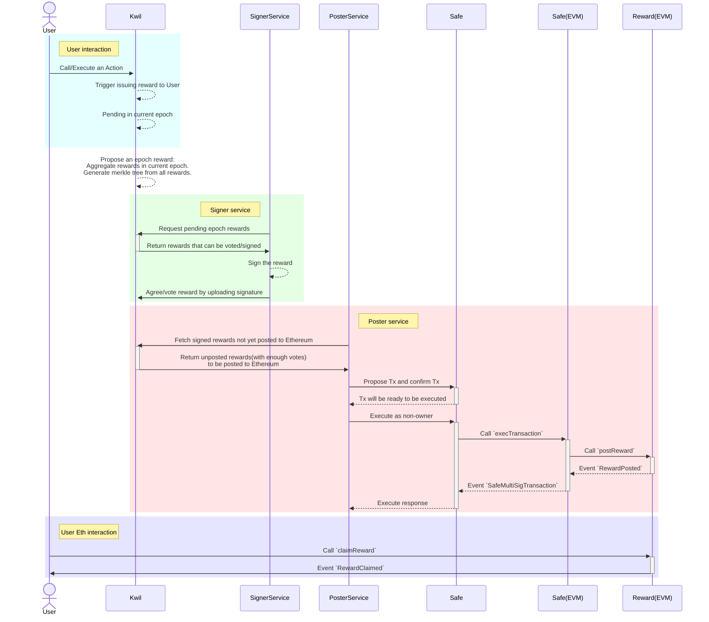

Kwil cross-network reward distribution platform.

## The workflow of distributing Kwil Reward

## Development with Sepolia testnet

Since we're using Safe, and it's hard to deploy a local full stack Safe
service, we're going to use Safe on Sepolia.

First copy `.env.example` to `.env` and fill in your mnemonic. Make sure you have
enough ETH(0.1 is enough) on Sepolia.

Go https://app.safe.global/home and create a Safe Wallet on Sepolia network, with
the first three derived wallets(from the mnemonic) as the owners of the Safe Wallet,
those wallets will be used in the tests/scripts.

After that, run `npm run redeploy:sepolia` to deploy RewardDistributor contract to
the Sepolia network. This will also deploy a mock erc20 token as the reward token.
Then put the contract address and Safe address to .env file.
