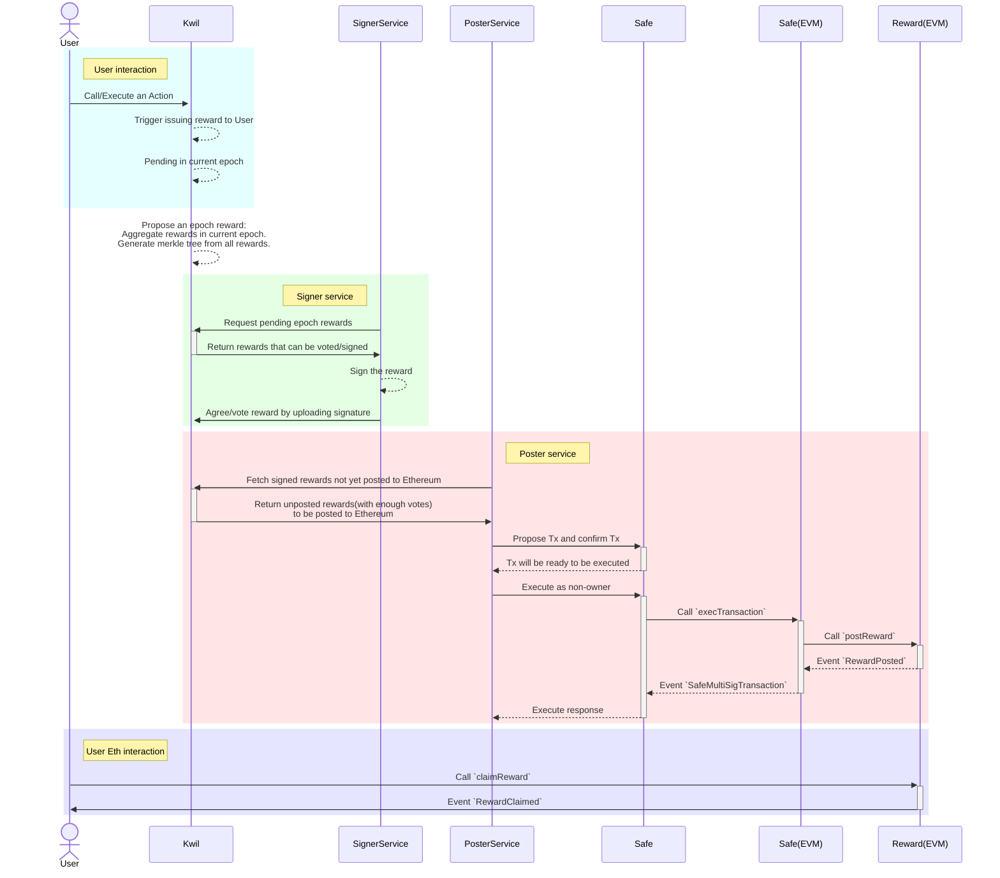

Kwil cross-network reward distribution platform.

## The workflow of distributing Kwil Reward



## Development with Sepolia testnet

Since we're using Safe, and it's hard to deploy a local full stack Safe
service, we're going to use Safe on Sepolia.

First copy `.env.example` to `.env` and fill in your mnemonic and rpc. Make sure you have
enough ETH(at least 0.1) on Sepolia.

Go https://app.safe.global/home and create a Safe Wallet on Sepolia network, with
the first few derived wallets(from the mnemonic) as the owners of the Safe Wallet
(those wallets will be used in the tests/scripts), and use the 1/x setting.
After creation, write the Safe Wallet address to .env file.

After that, run `npm run redeploy:sepolia` to deploy RewardDistributor contract to
the Sepolia network. This will also deploy a mock erc20 token as the reward token.
Then write the contract address and mock token address to .env file.

Then config a test wallet private key and its address to .env(for simplicity, use the first
wallet from the mnemonic).

> If by the time you use this we haven't put reward extension in to kwil-db, you'll
> need to build a special docker image in erc20-reward-extension by running `make docker`.

Now you have everything you need to use ./dev.sh, which runs everything in docker container.
This script has two functions:
- build: build signerSvc/posterSvc docker images.
- run-fresh: start a fresh environment, with db/kwild/signerSvc/posterSvc. All data will be deleted on stop.

So, if this is your first time, type:
```shell
./dev.sh build
./dev.sh run-fresh
```

## Testing the reward system

With `dev.sh` running every service, we'll test the reward system using kwil-cli.

```shell
# create a erc20_rewards targeting our Sepolia contract.
# NOTE: don't change `AS rewards`, since signerSVC/posterSVC use it.
.build/kwil-cli exec-sql "USE erc20_rewards {
    chain_id: 11155111, // target EVM chain id
    contract_address: '0x...', // target RewardDistributor contract address
    contract_nonce: 0, // RewardDistributor.nonce
    signers: '0x...,0x...,0x...', // the Signers you set in GnosisSafe wallet
    threshold: 1, // the confirmation settions in GnosisSafe wallet
    decimals: 18, // denotation of your reward token
    safe_address: '0x...', // GnosisSafe wallet address
    safe_nonce: 2 // GnosisSafe wallet nonce
} AS rewards;" --sync

# create a namespace to write our MoneyAPP logic
.build/kwil-cli exec-sql "CREATE NAMESPACE IF NOT EXISTS money;" --sync

# create an action in our MoneyAPP to issue reward to 0x...
.build/kwil-cli exec-sql "{money}CREATE ACTION issue_reward1() public {
        rewards.issue_reward('0x..',0.01::numeric(60,18));
}" --sync

# create an action in our MoneyAPP to issue reward to the caller.
.build/kwil-cli exec-sql "{money}CREATE ACTION issue_reward2() public {
        rewards.issue_reward(@caller,0.01::numeric(60,18));
}" --sync

# call our MoneyAPP's action to issue reward
.build/kwil-cli exec-action issue_reward1 -n money --sync
.build/kwil-cli exec-action issue_reward2 -n money --sync

# search the rewards being issued.
# Note: the reward will be accumulated.
.build/kwil-cli call-action search_rewards -n rewards int:0 int:10000

# propose a reward epoch.
# NOTE: this should/will be called by Kwil network automatically.
.build/kwil-cli exec-action propose_epoch -n rewards --sync

# list epoch rewards that are proposed.
# NOTE: those rewards will be picked up by SignerSvc.
.build/kwil-cli call-action list_epochs -n rewards int:0 int:10

# list finalized rewards.
# NOTE: Those rewards will be picked up by PosterSvc.
.build/kwil-cli call-action latest_finalized -n rewards int:10
```