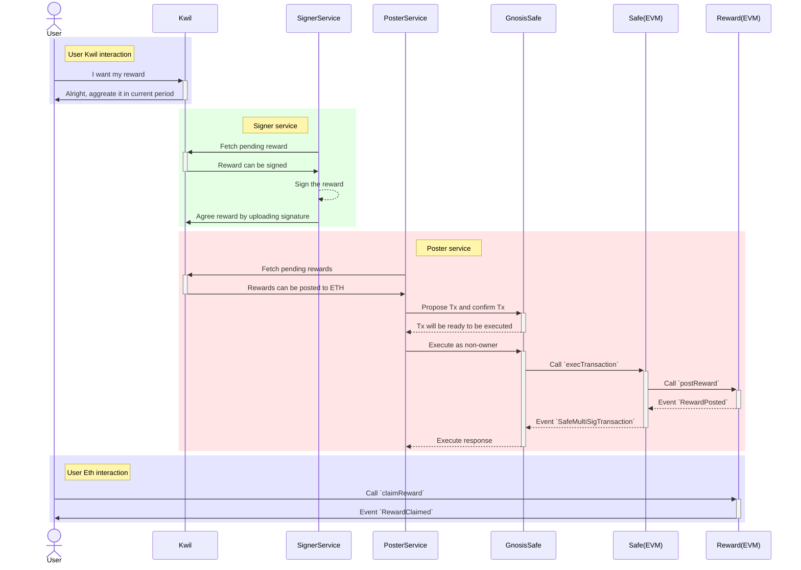

Kwil cross-network reward distribution platform.

## The workflow of distributing Kwil Reward

## Development

Since we're using GnosisSafe, and it's hard to deploy a local full stack GnosisSafe
service, we're going to use GnosisSafe on Sepolia.

First copy `.env.example` to `.env` and fill in your mnemonic. Make sure you have
enough ETH(0.1 is enough) on Sepolia.

Go https://app.safe.global/home and create a GnosisSafe Wallet on Sepolia network, with
the first three derived wallets as the owners of the GnosisSafe Wallet, those wallets
will be used in the tests/scripts.

After that, run `npm run redeploy:sepolia` to deploy RewardDistributor contract to
the Sepolia network. This will also deploy a mock erc20 token as the reward token.
Then put the contract address and Safe address to .env file.

Now you have everything except the Kwil network API. We're going to mock it in the tests.
Run `npm run test:poster:sepolia` will actually post/claim a stub Reward.
NOTE: you need to modify `kwilBlockHeight` everytime you run the test.