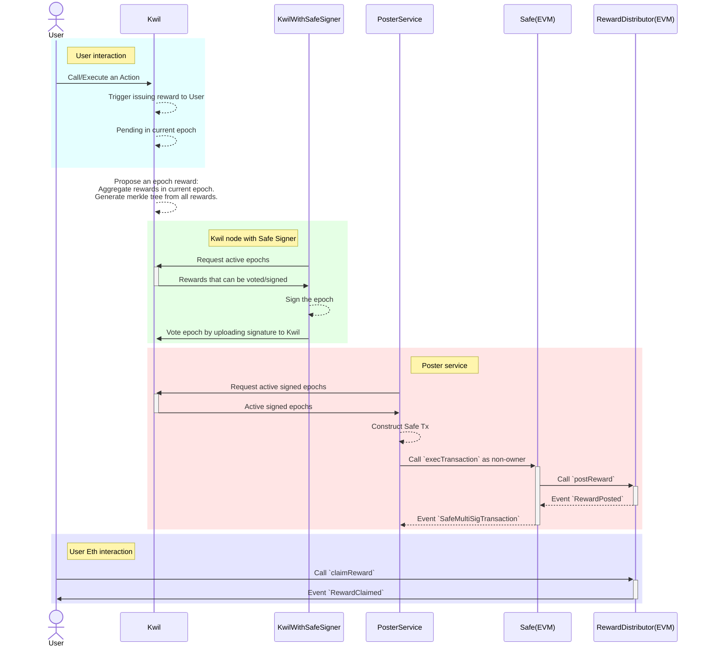

# Kwil erc-20 bridge

## Work flows

Read more on [poster service](./poster.md).

## Technical Overview

### Different roles involved

- Kwil: Kwil blockchain. Learn more about Kwil [here](https://docs.kwil.com).
- KwilWithSafeSigner: Kwil node with Safe Signer. It manages individual signatures for the SAFE wallet and uploads signatures to a Kwil database (to be used be `PosterService`).
- PosterService: A service that uses transactions from `SignerService` to propose/confirm/execute transactions through Safe to this contract.
- Safe: Safe wallet that has admin privileges to update a contract's state, through `postReward`/`updatePosterFee`.
- Reward: Kwil Reward escrow contract.
- User: A wallet which is able to claim reward through `claimReward`, providing proofs.

### Contracts

There are two contracts in this repo:
- [RewardDistributor](../contracts/RewardDistributor.sol) contract: which is a [minimal proxy contract](https://eips.ethereum.org/EIPS/eip-1167).  Read more at [here](./RewardDistributor.md)
- Factory contract, which creates both [Safe Wallet](https://safe.global/wallet) and [RewardDistributor](../contracts/RewardDistributor.sol).
